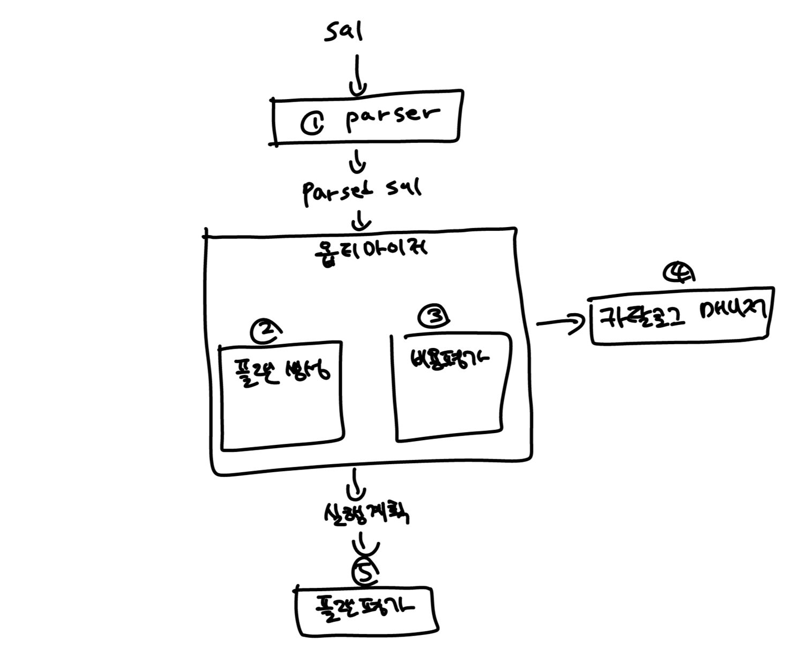

# DBMS와 실행계획

## 데이터에 접근하는 방법

### 파서(parser)
- 1번 파서의 역할은 사용자로부터 입력받은 SQL 구문 검사입니다.
- 입력받은 SQL의 문법에 틀린점이나, 존재하지 않는 테이블을 참조하는지 등의 검사를 수행합니다.
- 일반적인 프로그래밍 언어의 컴파일 이라고 생각할 수 있습니다.

### 옵티마이저(optimizer)
- 파서로부터 통과한 쿼리가 다음으로 도착하는 단계입니다. 
- 인덱스의 유무, 데이터 분산 or 편향 정도, DBMS 내부 매개변수 등의 조건을 고려해 선택 가능한 많은 실행계획을 작성(②)하고, 비용을 연산(③)합니다.
- 최종적으로 연산 비용이 가장 낮은 실행 계획을 선택합니다.

### 카탈로그 매니저(catalog manager)
- 옵티마이저가 실행 계획을 세울 때 옵티마이저에게 중요한 정보를 제공하는 것이 카탈로그 매니저(④)입니다.
- 카탈로그란 DBMS의 내부 정보를 모아놓은 테이블들로, 테이블 혹은 인덱스의 통계 정보가 저장되는 공간입니다.

### 플랜 평가(plan evaluation)
- 옵티마이저에서 생성된 여러개의 실행 계획 중 최적의 실행 결과를 선택하는 것이 플랜 평가(⑤)입니다.
- 인간이 읽기 쉽게 만들어진 계획서라고 볼 수 있습니다.

## 최적의 실행 계획이 작성되게 하려면
- 카탈로그의 통계 정보를 바탕으로 옵티마이저가 실행 계획을 세우게 되는데, 그렇다면 테이블의 데이터가 많이 변경되면 카탈로그의 통계 정보도 함께 갱신되어야 합니다.
- 통계 정보 갱신은 대상 테이블, 인덱스의 크기와 수에 따라서 몇십 분, 몇 시간이 소요되는 비용이 높은 작업이지만, DBMS가 최적의 플랜을 선택하려면 꼭 필요한 조건입니다.