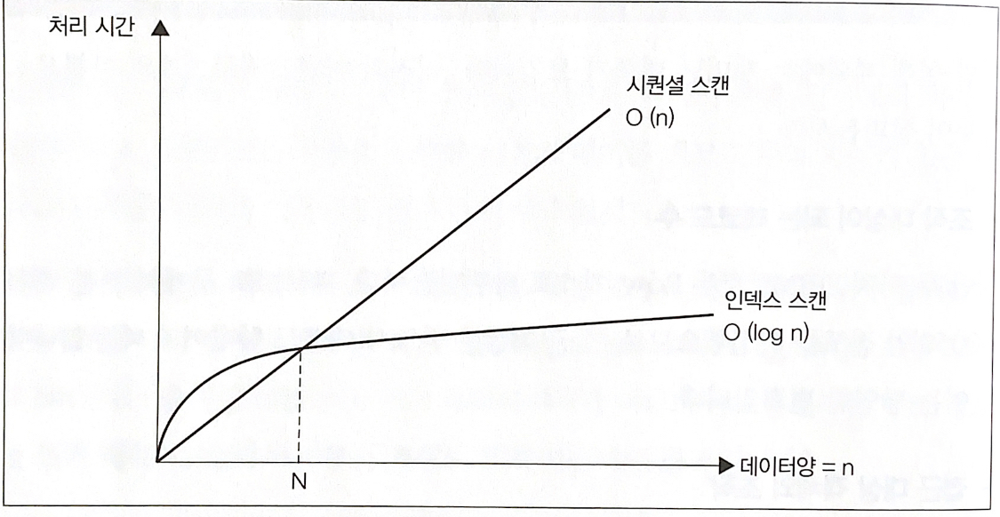

# 실행 계획이 SQL 구문의 성능을 결정

실행 계획이 만들어지면 DBMS는 그것을 바탕으로 데이터 접근을 수행합니다. 데이터양이 많은 테이블에 접근하거나 복잡한 SQL 구문을 실행하면 반응 지연이 발생하는 경우가 꽤 있는데, 이는 통계 정보의 부족 이외에도 SQL 구문 자체의 복잡성 등의 이유로 옵티마이저가 최적의 접근 경로를 선택하지 못할 수 있습니다.

## 실행 계획 확인 방법

- PostgreSql의 경우

```PostgreSql
EXPLAIN 테이블
```

### SQL 실행 계획을 알아보기 위한 shops 테이블

|shop_id|shop_name|rating|area|
|------|---|---|---|
|1|A상점|3|서울|
|2|B상점|5|속초|
|3|C상점|4|부산|

### 테이블 풀 스캔의 실행계획

```PostgreSql
EXPLAIN
SELECT *
FROM shops;
```

쿼리 수행 이후에 나타나는 출력 포맷을 살펴보면, DBMS 밴더가 다르더라도 공통적으로 가지고 있는 세 가지 특징이 있습니다.

1. 조작 대상 객체
2. 객체에 대한 조작의 종류
3. 조작 대상이되는 레코드 수

### 조작 대상 객체
- 기본적으로 테이블, 그 이외에도 인덱스, 파티션, 시퀀스 등의 객체가 올 수 있습니다.

### 객체에 대한 조작의 종류
- 위 쿼리의 결과로 나타나는 'Seq Scan'은 순차적 접근을 의미하며, 파일을 순차적으로 접근해서 해당 테이블의 전문을 읽어낸다는 의미이고, 일반적으로 <b>테이블 풀 스캔</b> 이라고 합니다.

### 조작 대상이 되는 레코드 수

- Row 라는 항목으로 출력되며, 결합 혹은 집약이 포함되면 개의 SQL 구문을 실행해도 여러 개의 조작이 수행됩니다. 참고로 Rows의 숫자는 카탈로그 매니저로부터 얻은 값입니다.

### 인덱스 스캔의 실행 계획

```PostgreSql
EXPLAIN
SELECT *
FROM shops
WHERE shop_id = 1;
```

- 실행 계획을 살펴보면 풀 스캔 쿼리와는 다르게, Index Scan이라는 키워드가 나타납니다.

- 또한 Rows가 1로 변경되었습니다. 이는 기본 키로 접근했기 때문에, 접근 대상은 반드시 하나일 수 밖에 없기때문입니다.


#### 인덱스 스캔, 풀 스캔의 효율성 차이


- 간략하게 설명하자면 인덱스 스캔은 이분탐색을 통해 효율적인 탐색으로 스캔 속도가 더 빠릅니다.

### 간단한 테이블 결합의 실행 계획

#### 결합을 위해 필요한 추가적인 테이블

- Reservations 테이블

|reservation_id|shop_id|reserve-name|
|--|------|---|
|1|1|A씨|
|2|2|B씨|
|3|3|C씨|

```PostgreSql
EXPLAIN
SELECT shop_name
FROM Shops s INNER JOIN Reservations R
ON S.shop_id = R.shop_id
```

- 일반적으로 RDBMS는 결합을 할 때 세 가지 종류의 알고리즘을 사용합니다.

#### Nested Loops
- 한쪽 테이블을 읽으면서 레코드 하나마다 결합 조건에 맞는 레코드를 다른 쪽 테이블에서 찾는 방식입니다. 이중 반복으로 구현됩니다.

#### Sort Merge
- 결합 키(shop_id)로 레코드를 정렬 후, 순차적으로 두 개의 테이블을 결합하는 방식입니다. 결합 전 전처리로 정렬을 수행하는데, 이 때 워킹 메모리를 사용합니다.

#### Hash
- 결합 키 값을 해시값으로 매핑하는 방법입니다. 마찬가지로 워킹 메모리를 사용합니다.

### 객체에 대한 조작의 종류

- 실행 계획의 결과를 보면 Nested Loop가 사용된 것을 알 수 있습니다.

- 실행 계획은 일반적으로 트리 구조입니다. 중첩 단계가 깊을수록 먼저 실행됩니다. 중첩 단계가 같다면 위에서 아래로 실행되는데, 그렇기 때문에 어떤 테이블에 먼저 접근하는지(driving table)가 굉장히 중요합니다.

