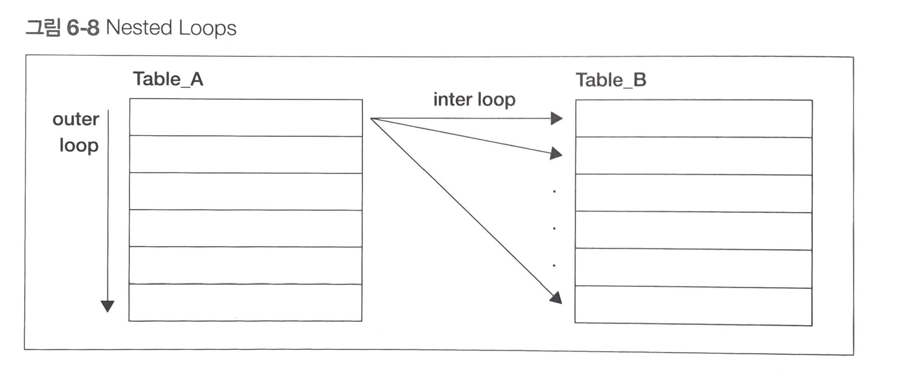
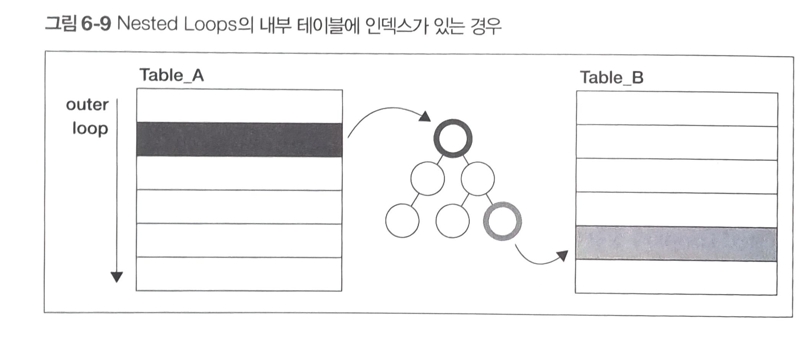
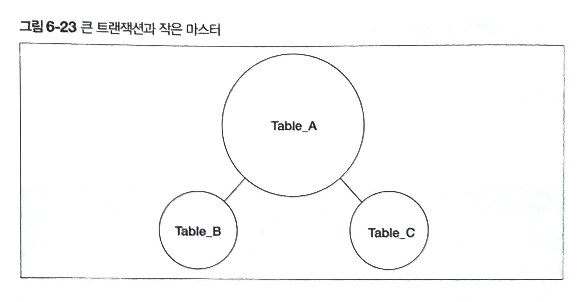
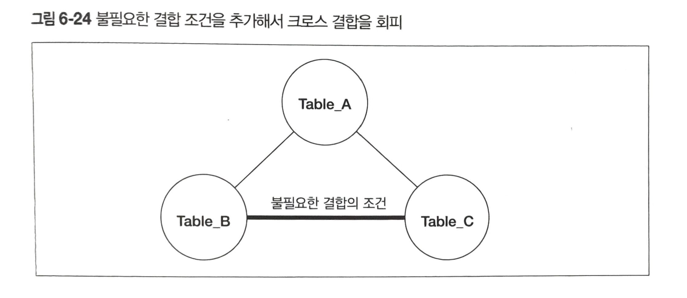

# 결합 알고리즘과 성능

## 옵티마이저가 선택 가능한 결합 알고리즘

### Nested Loops

- 중첩 반복을 사용하는 알고리즘입니다. SQL에서 결합은 한 번에 두 개의 테이블만 결합하므로, 이중 반복과 같은 의미입니다.

- 그림으로 나타내면 다음과 같습니다.



#### 세부 처리

1. Table_A(Driving Table)에서 레코드를 하나씩 반복해가면서 스캔
2. Driving Table의 레코드 하나마다, Table_B(Driven Table)의 레코드를 하나씩 스캔
3. 결합 조건에 맞으면 리턴
4. 1 ~ 3까지의 과정을 모든 레코드에서 반복

#### Nested Loops의 특징
- Table_A, Table_B를 결합할 때, 각 테이블의 레코드를 곱한 수(R(A) * R(B)) 만큼의 시간이 소요됩니다.
- Hash 또는 Sort Merge에 비해 메모리 소모가 적습니다.
- 모든 DBMS에서 지원합니다.

#### Driving Table의 중요성
- Driving Table로는 작은 테이블을 선택하는 것

    - Driven Table의 결합 키(FK)에 인덱스가 존재하는 경우에만 해당합니다.
    - 이 경우에, DBMS는 Driven Table을 완전히 순회하지 않아도 되기 때문에 반복을 어느정도 건너뛸 수 있습니다.(그림참조)

    -    

    - 가장 이상적인 경우는, Driven Table에서 가지고있는 Driving Table의 FK가 1:1 비율로 대응할 때, 반복을 완전히 생략할 수 있습니다.

    - 반면 1 : N 비율로 대응하게 된다면, 히트된 여러 개의 레코드에 반복을 적용해야 합니다.

#### Nested Loops의 단점
- 위와 같은 조건이더라도 성능이 잘 안나오는 경우가 있는데, 이는 결합 키로 Driven Table에 접근할 때 히트되는 레코드가 너무 많은 경우입니다.

- 인덱스를 사용해서 반복을 생략할 수 있다 하더라도 절대적인 양이 많다면 반복이 일어납니다.

-  구체적인 예시
   - 예를 들어, 상품 테이블과 상품에 대한 주문 테이블이 있다고 가정해보겠습니다.

    - 이 경우에 인기가 많은 상품의 경우 해당 상품에 대한 주문개수가 수 백만, 수 천만 건의 레코드가 히트될 수 있습니다.

    - 반대로 인기가 적은 상품의 경우 매칭되는 주문 건 수가 상대적으로 적기때문에 위 사례와 달리 고속으로 처리가 될 것입니다.


#### 해결 방법
- Driving Table <-> Driven Table

    - Driving Table로 큰 테이블을 선택하는 역설적인 방법이 있습니다.
    - 이렇게 하면 Driven Table에대한 주문 테이블의 접근이 기본 키로 수행되기때문에, 항상 하나의 레코드로 접근하는 것이 보장됩니다.
    - 따라서 점포에 따라 극단적으로 달라지는 성능 저하를 막을 수 있습니다.

- Hash 사용
    - 해시 결합은 우선 작은 테이블을 스캔 후, 결합 키에 해싱을 적용한 해시테이블을 생성합니다.
    - 이후에 다른 테이블을 읽어서 해시값이 일치하는 레코드를 반환합니다.

#### Hash의 특징
- 워킹 메모리에서 해시 테이블을 만들어내기 때문에, 메모리 소모가 큽니다.
- 그에 따른 메모리 부족이 발생하면 필연적으로 지연이 발생합니다.

#### Hash가 유용한 경우
- Nested Loops에서 충분히 작은 Driving Table이 존재하지 않은 경우
- Driven Table에서 히트되는 레코드 수가 너무 많은경우
- Driven Table에 인덱스가 존재하지 않는 경우

#### Hash 정리
- Hash를 사용할 때는 Nested Loops에 비해 소모되는 메모리 양이 크기때문에, 동시접근이 많은 일반적인 웹 어플리케이션의 경우 사용이 지양됩니다. 

- Hash 결합은 양쪽 테이블의 레코드를 전부 읽어야하기 때문에, 테이블의 규모가 굉장히 크다면 Nested Loops와 선택을 고려해봐야합니다.

### 의도치 않은 크로스 결합

#### 삼각 결합 예시
- 

```PostgreSql
SELECT A.col_a, B.col_b, C.col_c
FROM Table_A A
INNER JOIN Table_B B ON A.col_a = B.col_b
INNER JOIN Table_C C ON A.col_a = C.col_c;
```

- 결합 조건을 자세히 살펴보면, B, C 테이블은 A와 결합하고 있는 걸 알수있습니다.
- 몇 가지의 실행 계획이 나올 수 있는데, A와 B 결합 후, 그 결과를 C와 결합하는 경우는 괜찮지만, 크로스 결합이 선택되는 경우가 있습니다.

- B, C 처럼 결합 조건이 없는데 실행계획에 의해 선택되는 경우 크로스 결합이 발생합니다. 옵티마이저가 이런 실행 계획을 선택하는 이유는 다양하겠지만, 아마 B C 테이블이 작기때문에 선택했을 가능성이 높습니다.

#### 크로스 결합을 회피하는 방법

- 불필요한 결합 조건을 추가해서 크로스 결합을 회피할 수 있습니다.
- 

```PostgreSql
SELECT A.col_a, B.col_b, C.col_c
FROM Table_A A
INNER JOIN Table_B B ON A.col_a = B.col_b
INNER JOIN Table_C C ON A.col_a = C.col_c AND C.col_c = B.col_b;
```