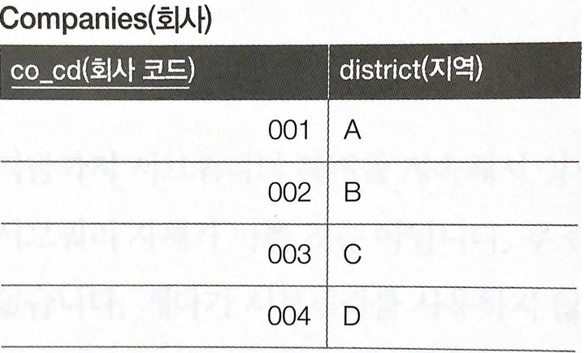
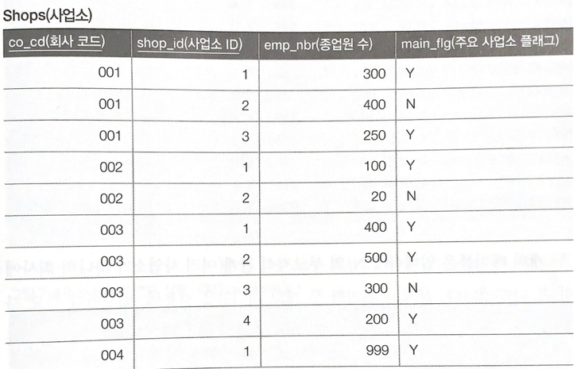
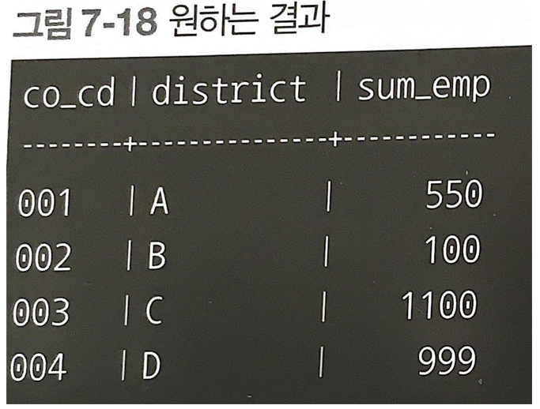

# 서브쿼리 사용이 더 나은 경우

결합과 관련된 쿼리에서는, 최대한 결합 대상 레코드 수를 줄이는 것이 중요합니다. 서브쿼리는 결합의 대상이 되는 데이터의 레코드를 줄일 수 있습니다.

## 결합과 집약 순서





- 다음과 같이, Companies(회사), Shops(사업소) 테이블이 1 : N 관계로 구성되어있을 때, 아래와 같은 결과를 구해야하는 상황이 있습니다.



- 결과를 구하기 위해서는 두 테이블의 결합이 필수적입니다.

### 결합 수행 후 집약

```PostgreSql
SELECT c.co_cd, MAX(c.district), SUM(emp_nbr) AS sum_emp
FROM Companies c
INNER JOIN Shops s ON c.co_cd = s.co_cd
WHERE main_flg = 'Y'
GROUP BY c.co_id;
```

- Companies와 Shops 테이블의 결합을 먼저 진행 후에 집약한 코드입니다. 서브쿼리가 없어 깔끔해 보이지만, main_flg 필터 처리가 안된 모든 Shops 테이블의 레코드를 결합하는데 사용하기 때문에 효율이 좋지않습니다.

### 집약 수행 후 결합

```PostgreSql
SELECT c.co_cd, c.district, WORK.sum_emp_nbr
FROM (
	SELECT co_cd, sum(emp_nbr) as sum_emp_nbr
	FROM shops
	WHERE main_flg = 'Y'
	GROUP BY co_cd
	) WORK 
INNER JOIN companies c ON WORK.co_cd = c.co_cd;
```

- Companies와 테이블과 Shops 테이블을 결합하기 전, 먼저 Shops 테이블의 레코드들을 집약하기 위한 서브쿼리 사용 후에 결합했습니다.

- 필터링을 먼저 거쳤기 때문에, 이전 방식보다 효율이 좋습니다.

